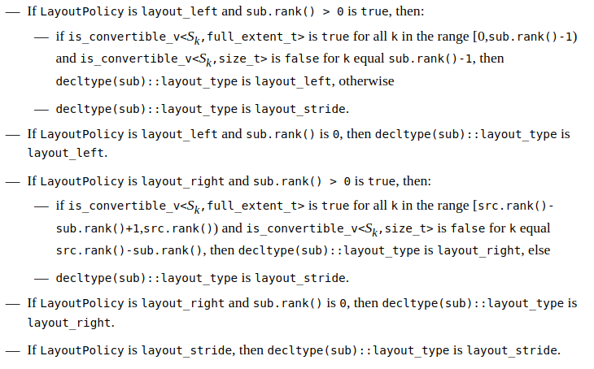

# mdspan-circle

View the [stable branch's README](https://github.com/kokkos/mdspan#readme).

View the [reference implementation](https://github.com/kokkos/mdspan/blob/a32d60ac5632e340c6b991f37910fd7598ea07cf/mdspan.hpp).

View the [Circle implementation](https://github.com/seanbaxter/mdspan/blob/circle/circle/experimental/mdspan).

[mdspan P0009](http://www.open-std.org/jtc1/sc22/wg21/docs/papers/2021/p0009r14.html) is a major library slated for inclusion in C++23. A [reference implementation](https://github.com/kokkos/mdspan) has been provided by the Kokkos team, with lots of good tests. A [single-header branch](https://github.com/kokkos/mdspan/blob/single-header/mdspan.hpp) is the best form for examining their work.

The mdspan proposal has been in revision since 2015, and improves on proposals that date much further back even. There are few modern C++ libraries as studied as mdspan. Unfortunately, the C++ ISO committee does not practice co-design. The needs of library implementers are not addressed by the language working groups, resulting in a core language that only supports the demands of its standard library with the most tortured of efforts. Even when targeting C++20, mdspan has to engages in the most astonishingly complex template metaprogramming you've ever seen.

The standard libraries are written by the most experienced C++ programmers, and should practice solid, clear, idiomatic C++. But that's rarely the case, because the ambitions of library authors far outstrip the capabilities of the language to support them.

I decided to rewrite mdspan in what I consider idiomatic Circle. When I couldn't cleanly translate part of the library, I added additional language features to the compiler to make the translation easy. The language grew to accommodate the library. The translated library compiles the [_unmodified_ mdspan tests](https://github.com/seanbaxter/mdspan/tree/circle/tests)--just point the compiler at the [circle](circle) folder instead of [include](include).

The result is an mdspan implementation that is concise. There is no evidence of violence in the code. It is frustration free. This document examines Circle solutions for the most infuriating aspects of the Stardard C++ mdspan implementation.

## Partial static storage.

```cpp
constexpr size_t dynamic_extent = size_t.max;

template<size_t... Extents>
struct extents {
  constexpr extents() = default;

  template<size_t... OtherExtents>
  requires((... && 
    (
      Extents == dynamic_extent ||
      OtherExtents == dynamic_extent ||
      Extents == OtherExtents
    )
  ))
  explicit((... ||
    (
      Extents != dynamic_extent &&
      OtherExtents == dynamic_extent
    )
  ))
  constexpr extents(const extents<OtherExtents...>& other);

  // One index per extent.
  template<SizeType... IndexTypes>
  requires(sizeof...(IndexTypes) == rank())
  explicit constexpr extents(IndexTypes... exts) noexcept;

  // One index per dynamic extent.
  template<SizeType... IndexTypes> requires(
    sizeof...(IndexTypes) != rank() && 
    sizeof...(IndexTypes) == rank_dynamic()
  )
  explicit constexpr extents(IndexTypes... exts) noexcept;

  constexpr size_t extent(size_t n) const noexcept;
}
```

The `extents` class template is the root of mdspan's troubles. It's an example of a generic type expressing _partial static storage_. The template is parameterized over N dimensions. Each dimension can be statically-sized (by a non-negative extent), or dynamically-sized with the constant `dynamic_extent`. The type should only include storage for the dynamic extents: a `size_t` for each one. Static extents are baked into the type of the class specialization.

There are three main challenges here, and Standard C++ measures horribly against all of them:
1. How do we implement partial static storage on types specified with a parameter pack? C++ doesn't have a mechanism for data member pack declarations, so multiple inheritance must be used. So right out of the gate, `extents` has a level of difficulty on par with `std::tuple`.
2. How do we define constructors? Two are needed: one that accepts one index per extent, and one that accepts one index per _dynamic extent_. The first constructor is pretty straight-forward: we directly pass those constructor parameters to our extent subobjects. But the second constructor is terribly difficult: we have to scatter the dynamic extents to non-contiguously defined dynamic extent subobjects, will still initializing the static-extent subobjects.
3. How do we access the n'th extent from a function parameter? If we stored all extents, we could use an array and use array subscripting. But partial static storage is irregular, so array subscripting is not available. We have to generate some kind of switch that maps indices to storage, for dynamic extents, or to the static extent template parameters, for static extents.

### Data member pack declarations.

To really kill this problem, I implemented data member pack declarations in Circle. 

[**pack.cxx**](pack.cxx)
```cpp
#include <iostream>

template<typename... Ts>
struct tuple {
  // A member pack declaration. Specializes to member names m0, m1, etc.
  Ts ...m;

  template<size_t Index>
  const auto& get() const noexcept {
    return m...[Index];
  }

  template<size_t Index>
  auto& get() noexcept {
    return m...[Index];
  }
};

// A deduction guide for CTAD.
template<typename... Ts>
tuple(Ts...) -> tuple<Ts...>;

int main() {
  tuple x { 1, 2.2, "Three" };

  std::cout<< "Access with pack subscripts:\n";
  std::cout<< "  "<< x.m...[0]<< "\n";
  std::cout<< "  "<< x.m...[1]<< "\n";
  std::cout<< "  "<< x.m...[2]<< "\n";

  std::cout<< "Access with pack expression:\n";
  std::cout<< "  "<< x.m<< "\n" ...;

  std::cout<< "Access with getter function:\n";
  std::cout<< "  "<< x.get<0>()<< "\n";
  std::cout<< "  "<< x.get<1>()<< "\n";
  std::cout<< "  "<< x.get<2>()<< "\n";

  std::cout<< "Access with injected names:\n";
  std::cout<< "  "<< x.m0<< "\n";
  std::cout<< "  "<< x.m1<< "\n";
  std::cout<< "  "<< x.m2<< "\n";

  std::cout<< "Access with reflection:\n";
  std::cout<< "  "<< decltype(x).member_decl_strings<< ": "<< 
    x.@member_values()<< "\n" ...;
}

```
```
$ circle pack.cxx
$ ./pack
Access with pack subscripts:
  1
  2.2
  Three
Access with pack expression:
  1
  2.2
  Three
Access with getter function:
  1
  2.2
  Three
Access with injected names:
  1
  2.2
  Three
Access with reflection:
  int m0: 1
  double m1: 2.2
  const char* m2: Three
```

Standard C++ supports inheriting from a pack of base classes, but not creating a pack of non-static data members. This is really troublesome, as data members are usually what you want. This is one of the forms proposed in [P1858 - Generalized pack declarations and usage](http://www.open-std.org/jtc1/sc22/wg21/docs/papers/2020/p1858r2.html#member-packs).

Index into a member pack with the [pack subscript](https://github.com/seanbaxter/circle/blob/master/universal/README.md#static-subscripts-and-slices) operator `...[index]`. 

### Member packs and `[[no_unique_address]]`

To implement partial static storage for our `extents` class, we need to declare a pack of extent storage objects with [[no_unique_address]], a C++ 20 layout attribute.

[**extent.cxx**](extent.cxx)
```cpp
#include <type_traits>
#include <limits>
#include <iostream>

constexpr size_t dynamic_extent = size_t.max;

template<typename Type>
concept SizeType = std::is_convertible_v<Type, size_t>;

template<size_t index, size_t Extent>
struct _storage_t {
  // static storage.
  constexpr _storage_t(size_t extent) noexcept { }
  static constexpr size_t extent = Extent;
};

template<size_t index>
struct _storage_t<index, dynamic_extent> {
  // dynamic storage.
  constexpr _storage_t(size_t extent) noexcept : extent(extent) { }
  size_t extent;
};

template<size_t... Extents>
struct extents {
  template<SizeType... IndexTypes>
  constexpr extents(IndexTypes... indices) noexcept : m(indices)... { }

  constexpr size_t extent(size_t i) const noexcept {
    return i == int... ...? m.extent : 0;
  }

  // Partial static storage.
  [[no_unique_address]] _storage_t<int..., Extents> ...m;
};

int main() {
  extents<3, 4, dynamic_extent, dynamic_extent, 7> m(3, 4, 5, 6, 7);

  // Only use 8 bytes per *dynamic* extent.
  static_assert(2 * sizeof(size_t) == sizeof(m));

  // Print out each extent, dynamic or static.
  for(int i : 5)
    std::cout<< m.extent(i)<< "\n";
}
```
```
$ circle extent.cxx
$ ./extent
3
4
5
6
7
```

The C++20 attribute [`[[no_unique_address]]`](https://en.cppreference.com/w/cpp/language/attributes/no_unique_address) makes empty class member subobjects have layout similar to empty class base subobjects. An empty `[[no_unique_address]]` data member gets positioned at byte offset 0, unless there is another subobject _of the same type_ at that offset. If so, a layout attempt is made at byte offset 1, then 2, etc. As long as empty `[[no_unique_address]]` subobjects have unique types, they don't take up any storage, and are always pinned at byte offset 0.

We define a class template `_storage_t` which reflects the Extent template parameter for static extents, and provisions storage when the template parameter is `dynamic_extent`. Empty types are differentiated by parameterization over the index of the extent within the parameter pack. `_storage_t<4, 3> and _storage_t<7, 3>` would have overlapping/non-unique storage because, even though they reflect the same `extent` parameter, they are parameterized over different indices.

```cpp
  // Partial static storage.
  [[no_unique_address]] _storage_t<int..., Extents> ...m;
```

Pack declarations let us generate a collection of partial-static storage members with a single line of code. The [pack index operator](https://github.com/seanbaxter/circle/blob/master/universal/README.md#pack-indices) `int...` yields the current index of the pack expansion as an integer. This creates a unique `_storage_t` specialization for each member. The `Extents` template argument names the template parameter pack of the `extents` class. A `...` token immediately preceding the _declarator-id_ on a non-static data member declaration creates the member pack.

```cpp
  template<SizeType... IndexTypes>
  constexpr extents(IndexTypes... indices) noexcept : m(indices)... { }
```

Subobject initialization works the same for member packs as for base class packs. Just use `...` after the subobject's initializer. Each instantiated member `m` is constructed with one element from the `indices` function parameter pack.

### Accessing extents.

```cpp
  constexpr size_t extent(size_t i) const noexcept {
    return i == int... ...? m.extent : 0;
  }
```

To subscript into partial static storage, we need to metaprogram control flow that maps the function argument to a pack declaration. Circle has the [multi-ternary operator](https://github.com/seanbaxter/circle/blob/master/conditional/README.md#multi-conditional---) `...?` which does this concisely. Think of it is a _fold-expression_ for the conditional operator. The left-hand operand is a boolean pack. The center operand is a pack or non-pack expression that is result object when a left-hand element evaluates to true. The right-hand operand is the result object when all elements of the left-hand pack evaluate to false.

The left-hand operand `i == int...` expands to { i == 0, i == 1, i == 2, etc }. `m.extent` is a pack expression, which expands to { m...[0].extent, m...[1].extent, m...[2].extent, etc }. Connecting with the multi-ternary operator yields an expression similar to
```
  return i == 0 ? m...[0].extent :
         i == 1 ? m...[1].extent :
         i == 2 ? m...[2].extent :
         /* up to N elements */  : 
         0;
```

This is easy control flow for the LLVM optimizers to deal with. The expression is likely to be promoted to a `switch` instruction, which may utilize a jump table for constant-time mapping.

## `extents` construction.

Constructing an `extents` object from the set of _dynamic extents_ is extraordinarily hard with C++20. The reference implementation's solution requires hundreds of lines, lots of recursion, partial specialization, and subobject linked lists. 
https://github.com/kokkos/mdspan/blob/a32d60ac5632e340c6b991f37910fd7598ea07cf/mdspan.hpp#L2399

But Circle has very convenient pack operators, and we can achieve it with just one simple variable template, `find_dynamic_index`.

```cpp
template<size_t... Extents>
struct extents {
  // Map index I to dynamic index J.
  template<size_t I>
  static constexpr size_t find_dynamic_index = 
    (0 + ... + (dynamic_extent == Extents...[:I]));

  // One index per dynamic extent.
  template<SizeType... IndexTypes> requires(
    sizeof...(IndexTypes) != rank() && 
    sizeof...(IndexTypes) == rank_dynamic()
  )
  explicit constexpr extents(IndexTypes... exts) noexcept : m(
    dynamic_extent == Extents ?? 
      exts...[find_dynamic_index<int...>] : 
      Extents
  )... { }

  // Other stuff ...
};
```

Consider the mem-initializer-list expression:

```cpp
dynamic_extent == Extents ?? exts...[find_dynamic_index<int...>] : Extents
```

When expanded for each i between 0 and sizeof... Extents, we either want to yield `Extents...[i]` (when i corresponds to a static extent), or the next available element of the function parameter pack `exts`. We'll approach this as an assignment operation (for static extents) or a gather operation (for dynamic extents).

`find_dynamic_index<int...>` maps the rank of an extent to the rank of the corresponding extent when only considering dynamic extents. This function is all about counting: how many dynamic extents _precede_ the template argument? It's very handy to have [pack slices](https://github.com/seanbaxter/circle/blob/master/universal/README.md#static-subscripts-and-slices) for this purpose:

```cpp
  template<size_t I>
  static constexpr size_t find_dynamic_index = 
    (0 + ... + (dynamic_extent == Extents...[:I]));
```

`Extents...[:I]` slices the `Extents` pack, truncating it to a pack of only its first `I` elements. Each of these first `I` extents is compared against `dynamic_extent`, and those result objects are added up with a _fold-expression_.

```cpp
dynamic_extent == Extents ?? exts...[find_dynamic_index<int...>] : Extents
```

Note the `??` operator in the dispatch. This is the [constexpr conditional](https://github.com/seanbaxter/circle/blob/master/conditional/README.md#constexpr-conditional--) operator. It requires a constant left-hand operand, and short-circuits _substitution_ of the center or right-side operand according to the value of the left-hand operand. This means that the `find_dynamic_index` variable template is only instantiated for dynamic extents. This is a critical operator. If we used the runtime conditional `?:`, our program would be ill-formed when the last extent is a static extent. Specializing `find_dynamic_index` on any extent past the last dynamic extents would return the total number of dynamic extents, resulting in an out-of-bounds subscript into the function parameter pack `exts`.

## Specifying dynamic extents.

[**mdspan.hpp**](https://github.com/kokkos/mdspan/blob/a32d60ac5632e340c6b991f37910fd7598ea07cf/mdspan.hpp#L3320)
```cpp
namespace detail {

template <size_t Rank, class Extents = ::std::experimental::extents<>>
struct __make_dextents;

template <size_t Rank, size_t... ExtentsPack>
struct __make_dextents<Rank, ::std::experimental::extents<ExtentsPack...>> {
  using type = typename __make_dextents<Rank - 1,
    ::std::experimental::extents<::std::experimental::dynamic_extent, ExtentsPack...>>::type;
};

template <size_t... ExtentsPack>
struct __make_dextents<0, ::std::experimental::extents<ExtentsPack...>> {
  using type = ::std::experimental::extents<ExtentsPack...>;
};

} // end namespace detail

template <size_t Rank>
using dextents = typename detail::__make_dextents<Rank>::type;
```

mdspan proposes quality-of-life utilities. One of these is the `dextents` alias template, which specializes `extents` with `dynamic_extent` repeated N times. Sadly, metaprogramming template arguments in C++20 is super difficult. The reference implementation recursively specializes `__make_dextents`, with a partial specialization serving to terminate recursion, and each class defining an alias with an incompletely-specialized `extents` typedef. More concise treatments are possible, but they are even less intuitive.

```cpp
// Spam out dynamic_extent Rank times.
template<size_t Rank>
using dextents = extents<for i : Rank => dynamic_extent>;
```

[Circle Imperative Arguments (CIA)](https://github.com/seanbaxter/circle/tree/master/imperative#argument-for) includes an _argument-for_ production that makes this trivial. You can use _argument-for_ inside _template-argument-list_, _function-argument-list_ or _initializer-list_ to loop over an index and yield a type, non-type or template entity after the `=>` token.

This code loops `i` from 0 to Rank - 1, and inserts `dynamic_extent` into the argument list at each step.

## Computing layout offsets

[**mdspan.hpp**](https://github.com/kokkos/mdspan/blob/a32d60ac5632e340c6b991f37910fd7598ea07cf/mdspan.hpp#L3394)
```cpp
struct layout_right {
  template <class Extents>
  class mapping {
  private:
    template <size_t r, size_t Rank>
    struct __rank_count {};

    template <size_t r, size_t Rank, class I, class... Indices>
    constexpr size_t __compute_offset(
      size_t offset, __rank_count<r,Rank>, const I& i, Indices... idx) const {
      return __compute_offset(offset * __extents.template __extent<r>() + i,__rank_count<r+1,Rank>(),  idx...);
    }

    template<class I, class ... Indices>
    constexpr size_t __compute_offset(
      __rank_count<0,Extents::rank()>, const I& i, Indices... idx) const {
      return __compute_offset(static_cast<size_t>(i),__rank_count<1,Extents::rank()>(),idx...);
    }

    constexpr size_t __compute_offset(size_t offset, __rank_count<Extents::rank(), Extents::rank()>) const {
      return offset;
    }

    template <class... Indices>
    constexpr size_type operator()(Indices... idxs) const noexcept {
      return __compute_offset(__rank_count<0, Extents::rank()>(), idxs...);
    }
    
    // Other stuff ...
  };
};
```

mdspan provides three predefined _LayoutPolicies_ and accommodates user-defined ones. The role of the _LayoutPolicy_ is to combine the N-dimensional index vector with the static and dynamic extents, and possibly with additional _LayoutPolicy_-managed terms, like strides.

`layout_right` defines a column-major (Fortran-style) mapping of an index vector to a pointer offset. You can't naively loop over all ranks, because there are structural issues when trying to access data:
* You can't subscript the function parameter pack `idx` from a loop index.
* You can't subscript the partial static storage templated accessor function `__extent` from a loop index.
* The implementation uses function overloads to guarantee loop unrolling, at the cost of a function specialization and invocation for each rank in the mapping.

The real problem here is legibility: why does the second overload exist, how is it different from the generic first case? This kind of accumulation requires growing the offset multiplying the extent at each step, except for the very first step (where the first argument of `__rank_count` is 0). C++20 lacks mechanisms for compile-time loops. 

[**mdspan**](circle/experimental/mdspan)
```cpp
    template<typename... Indices>
    constexpr size_t compute_offset(Indices... indices) const noexcept {
      // The right-most extent is the most quickly varying.
      size_t x = 0;
      @meta for(int i : sizeof... indices) {
        @meta if(i != 0)
          x *= _extents.template get<i>();
        x += indices...[i];
      }
      return x;
    }
```

Circle supports compile-time control flow. Just put the `@meta` token in front of an _if_-, _while_-, _for_- or _do_-statement. The compiler frontend executes the loop during instantiation, and the step index is available as a compile-time value.

The logic of `compute_offset` is transparent in the Circle version of mdspan. You loop over each function parameter, grow the accumulator by multiplying by the i'th extent if we aren't on the first member (although the accumulator is seeded to 0, so this would be a benign operation were it executde), and add in the current index. `i` is a compile-time value, so it can be used as a template argument or a pack subscript.

## `submdspan`

The reference implementation for the function `submdspan` terrifies. The operation aims to construct an M-dimensional view into an N-dimensionsal span, where M <= N. The difficulty is doing this in a space-efficient manner, so that static extents are preserved, and stride data is only introduced when required. (Such as when a requested extent is smaller than the source extent, and that extent isn't the first/last extent in a col-major/row-major _LayoutPolicy_.) 

C++20 and C++23 are completely ill-suited for expressing this function that is part of C++23. Mechanisms needed for a sane implementation are not even under serious consideration for language evolution.

[**mdspan.hpp**](https://github.com/kokkos/mdspan/blob/a32d60ac5632e340c6b991f37910fd7598ea07cf/mdspan.hpp#L4787)
```cpp
template <class ET, size_t... Exts, class LP, class AP, class... SliceSpecs, size_t... Idxs>
MDSPAN_INLINE_FUNCTION
constexpr auto _submdspan_impl(
  integer_sequence<size_t, Idxs...>,
  mdspan<ET, std::experimental::extents<Exts...>, LP, AP> const& src,
  SliceSpecs&&... slices
) noexcept
{
  auto _handled =
    _MDSPAN_FOLD_ASSIGN_LEFT(
      (
        detail::__assign_op_slice_handler<
          detail::preserve_layout_analysis<LP>
        >{
          __partially_static_sizes<>{},
          __partially_static_sizes<>{},
          __partially_static_sizes<>{}
        }
      ),
        /* = ... = */
      detail::__wrap_slice<
        Exts, dynamic_extent
      >(
        slices, src.extents().template __extent<Idxs>(),
        src.mapping().template __stride<Idxs>()
      )
    );

  size_t offset_size = src.mapping()(_handled.__offsets.template __get_n<Idxs>()...);
  auto offset_ptr = src.accessor().offset(src.data(), offset_size);
  auto map = _handled.make_layout_mapping(src.mapping());
  auto acc_pol = typename AP::offset_policy(src.accessor());
  return mdspan<
    ET, decltype(map.extents()), typename decltype(_handled)::layout_type, decltype(acc_pol)
  >(
    std::move(offset_ptr), std::move(map), std::move(acc_pol)
  );
}
```

The entry point for the `submdspan` reference implementation is not too bad. A source `mdspan` is provided, and its _ElementType_, _Extents_, _LayoutPolicy_ and _AccessorPolicy_ are deduced. 

The user provides the N-dimensional pack of _SliceSpecs_, where each member may be one of three types:
* `size_t` - Dynamically slice the source span one this dimension. It reduces the rank of the returned span by one. This incurs a pointer adjustment to the source's data, and then its extent and stride are dropped.
* `tuple<size_t, size_t>` - Build a view into a (begin, end) interval on this dimension. This carries over to the returned span as an addressible dimension, and it may incur a `layout_stride` on the returned span.
* `full_extent_t` - Copy over the extent from the source to the returned span. Compared to specifying a full extent with the `tuple` case, this avoids introducing a costly `layout_stride`.

The [mdspan proposal P0009](http://www.open-std.org/jtc1/sc22/wg21/docs/papers/2021/p0009r14.html) defines behavior based on analyzing the occurrence of these three _SliceSpecs_ types, against the _LayoutPolicy_ of the source span. That is the meat of `submdspan`, and it's delegated to `__assign_op_slice_handler` by the reference implementation. The logic of the slice handler runs for nearly [300 lines](https://github.com/kokkos/mdspan/blob/a32d60ac5632e340c6b991f37910fd7598ea07cf/mdspan.hpp#L4492). The relation of the text in the proposal to the C++ code is totally obscured by workarounds needed to address the language's lack of metaprograming expressiveness.

The Circle implementation closely follows the proposal, and is implemented in four main operations:
1. Compute the pointer offset due to the `tuple` and `full_extent_t` _SliceSpecs_ types. This uses the Circle [constexpr conditional](https://github.com/seanbaxter/circle/blob/master/conditional/README.md#constexpr-conditional--) operator `??`.
2. Compact the extents from the `slices` function arguments. This involves an argument list/initializer list filtering operation, and uses CIA's [_argument-if-else_](https://github.com/seanbaxter/circle/tree/master/imperative#argument-if).
3. Analyze the types of the _SliceSpecs_ and determine the _LayoutPolicy_ of the returned span. This uses [pack slices and subscripts](https://github.com/seanbaxter/circle/blob/master/universal/README.md#static-subscripts-and-slices), and a new short-circuiting constexpr logical operator `&&&`.
4. Initialize the returned object mdspan type. This uses _argument-if_ to filter strides when constructing a `layout_stride` policy.

### `submdspan` pointer adjustment.

```cpp
constexpr auto submdspan(const mdspan<ET, extents<Exts...>, LP, AP>& src,
  SliceSpecs... slices) {
 
  using tuple = std::tuple<size_t, size_t>;
  constexpr size_t rank = src.rank();

  // * For size_t slice, skip the extent and stride, but add an offset
  //   corresponding to the value.
  // * For a std::full_extent, offset 0 and old extent.
  // * For a std::tuple, add an offset and add a new dynamic extent 
  //   (strides still preserved).
  size_t offset = src.mapping()(
    std::is_convertible_v<SliceSpecs, size_t> ??
      (size_t)slices :
    std::is_convertible_v<SliceSpecs, tuple> ??
      std::get<0>((tuple)slices) :
      0 ...
  );

  // ...
}
```

To create a submdspan, we need to adjust the pointer of the source span by calling the mapping's `operator()` with the N-dimensional vector of offsets. 
* If the `SliceSpecs` type is convertible to `size_t`, then we adjust that dimension by that `size_t` value.
* If the `SliceSpecs` type is convertible to `std::tuple`, convert it and take the 0 component, which is the begin offset.
* Otherwise, the type must be `full_extent_t`, which implies a 0 adjustment for that dimension.

The constexpr conditional operator `??` lets us put all three cases in one pack expression. The C++ conditional operator `?` would not work here, because the convert to `size_t` or `tuple` would cause a substitution failure, leaving the program ill-formed. The constexpr conditional guards against invalid conversions.

### Reducing extents.

```cpp
  using Extents = extents<
    if std::is_convertible_v<SliceSpecs, tuple> => dynamic_extent else
    if std::is_convertible_v<SliceSpecs, full_extent_t> => Exts ...
  >; 
  constexpr size_t rank2 = Extents::rank();

  Extents dynamic_extents {
    if std::is_convertible_v<SliceSpecs, tuple> => 
      std::get<1>((tuple)slices) - std::get<0>((tuple)slices) 
    else if std::is_convertible_v<SliceSpecs, full_extent_t> =>
      src.extent(int...) ...
  };
```

`submdspan` involves a dimensionality reduction, depending on the types of the slice arguments. We specialize the `extents` class template on this compacted set of source extents. The _argument-if_ feature is critical for this. Inside the _template-argument-list_, _if_ the slice type converts to `tuple`, _then_ push `dynamic_extent`. _Else_, _if_ the slice type converts to `full_extent_t, _then_ push the corresponding extent of the source. Otherwise, push nothing. Continue to the next element.

This is a form of compaction that normally calls for recursion into partial templates in Standard C++.

After forming the `extents` specialization, we have to construct it with an appropriate subset of the source's extents. There are two choices: 
1. Pass the result object's `extents` constructor one argument per extent, or
2. Pass the result object's `extents` constructor one argument per _dynamic_ extent.

```cpp
  Extents sub_extents {
    if std::is_convertible_v<SliceSpecs, tuple> => 
      std::get<1>((tuple)slices) - std::get<0>((tuple)slices) 
    else if std::is_convertible_v<SliceSpecs, full_extent_t> =>
      src.extent(int...) ...
  };
```

This _argument-if_ usage wrangles all the extents for the result object: that is, if the slice type is a `tuple` or a `full_extent_t`, then the extent is emitted as a constructor argument.

```cpp
  Extents sub_extents {
    if std::is_convertible_v<SliceSpecs, tuple> => 
      std::get<1>((tuple)slices) - std::get<0>((tuple)slices) 
    else if std::is_convertible_v<SliceSpecs, full_extent_t> && 
      dynamic_extent == Exts =>
      src.extent(int...) ...
  };
```

It's not any harder to call the dynamic extents constructor. All `tuple` slice types imply dynamic extents, as do `full_extent_t` slice types _with a corresponding `dynamic_extent` `Exts` template parameter.

Either of these is fine, but the constructor called by the former version will compile a bit quicker.

### Choosing a _LayoutPolicy_



This is the most complex requirement in the whole mdspan proposal. Since _LayoutPolicy_ is part of the `mdspan` type, the requirement must be evaluated _at compile time_. 

```cpp
  // If LayoutPolicy is layout_left and sub.rank() > 0 is true, then:
  // if is_convertible_v<Sk,full_extent_t> is true for all k in the range
  //   [0, sub.rank() - 1) and is_convertible_v<Sk,size_t> is false for k equal
  //   sub.rank()-1, then decltype(sub)::layout_type is layout_left.
  constexpr bool is_layout_left = layout_left == LP &&& (!rank2 |||
    (... && std::is_convertible_v<SliceSpecs...[0:rank2 - 1], full_extent_t>) &&&
    !std::is_convertible_v<SliceSpecs...[rank2 - 1], size_t>
  );

  // If LayoutPolicy is layout_right and sub.rank() > 0 is true, then:
  // if is_convertible_v<Sk,full_extent_t> is true for all k in the range
  //   [src.rank()-sub.rank()+1,src.rank()) and is_convertible_v<Sk,size_t>
  //   is false for k equal src.rank()-sub.rank(), 
  //   then decltype(sub)::layout_type is layout_right.
  constexpr size_t is_layout_right = layout_right == LP &&& (!rank2 |||
    (... && std::is_convertible_v<SliceSpecs...[rank - rank2 + 1:rank], full_extent_t>) &&&
    !std::is_convertible_v<SliceSpecs...[rank - rank2], size_t>
  );
```

Circle allows us to compute the `layout_left` conditions in one statement and the `layout_right` conditions in one statement. If both declarations are false, then the `layout_stride` policy is used.

Note the use of `&&&` and `|||` operators. These are _short-circuit constexpr logical_ operators, added to Circle to support this library. They express the semantics of [`std::conjunction_v`](https://en.cppreference.com/w/cpp/types/conjunction) and [`std::disjunction_v`](https://en.cppreference.com/w/cpp/types/disjunction), but as language builtins to encourage you to actually use them!

If and only if `layout_right == LP` is true will the rhs of `&&&` be substituted and evaluated. The rhs first evaluates `!rank2`, and if and only if that is _false_ will the rhs of `|||` be substituted and evaluated. This disjunction short-circuit is critical, because the program may be ill-formed without it. Consider the case of an empty source with no extents, so `SliceSpecs` is an empty pack. `rank` and `rank2` are both 0. The pack subscript expression `SliceSpecs...[rank - rank2]` attempts to access the 0'th member of the pack, but that's out of bounds, so the build breaks. 

Short-circuit constexpr conjunction and disjunction operators reduce translation times by eliminating the substitution of irrelevent operands, but more importantly, allow the programmer to guard against unwanted behavior in argument lists, the same way they would guard runtime code with the ordinary logical operators.

### Building the result object.

```cpp
  if constexpr(is_layout_left || is_layout_right) {
    // Use the source's layout policy.
    return mdspan<ET, Extents, LP, AP>(
      src.data() + offset,
      typename LP::template mapping<Extents>(sub_extents),
      src.accessor()
    );

  } else {
    // Use layout_stride policy.   
    std::array<size_t, Extents::rank()> strides {
      if !std::is_convertible_v<SliceSpecs, size_t> => src.stride(int...) ...
    };

    return mdspan<ET, Extents, layout_stride, AP>(
      src.data() + offset,
      layout_stride::mapping<Extents>(sub_extents, strides),
      src.accessor()
    );
  }
}
```

The last step of Circle's `submdspan` implementation constructs the result object `mdspan` specialization. If the layout is `layout_left` or `layout_right`, we specialize the span over the source's _LayoutPolicy_ and construct the span without strides, and specialize. Otherwise, the span is specialized over `layout_stride`, and initialized with an `std::array` of strides for each extent. This is yet another example of _argument-if_ filtering template arguments straight into an argument list. If the slice type is _not_ convertible to `size_t`, then the corresponding stride is fetched from the source span. This works even when the source span is specialized on a non-strided layout; the stride is synthesized in those cases.